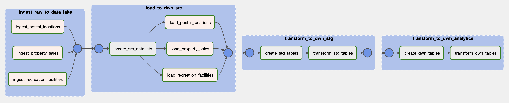

# Toronto Rec Facilities - Data Pipeline

## Overview

* Goal is to prepare a basic data pipeline that combines home sales with locations of recreational facilities
* The combined dataset can be potentially used for further descriptive reporting and machine learning training
* Final dataset consists of home sales alongside proximity to closest facility and nearby facilities count
    * Output facility types: parks, community centres

## Source Data Files

1. Home Sales in Ontario - Kaggle Dataset (Zipped CSV)
    * Description: https://www.kaggle.com/thiagoribeiro/house-sales-in-ontario-data-analysis/data
    * File: https://toronto-property-sales-kaggle.s3.us-west-2.amazonaws.com/properties.zip
    * Raw Attributes: Address, AreaName, Price ($), lat, lng

2. Toronto Open Data Catalogue - Parks and Recreation Facilities (CSV)
    * Description: https://ckan0.cf.opendata.inter.prod-toronto.ca/en/dataset/parks-and-recreation-facilities
    * File: https://ckan0.cf.opendata.inter.prod-toronto.ca/dataset/cbea3a67-9168-4c6d-8186-16ac1a795b5b/resource/61691590-4c3f-42d3-94c5-443ad3856f64/download/Parks%20and%20Recreation%20Facilities%20-%204326.csv
    * Raw Attributes: Location, Facility Name, Facility Type (Park, Community Centre), Address, Latitude, Longitude

3. Canadian Postal Codes with GeoCoordinates by Service Objects (Zipped CSV)
    * Description: https://www.serviceobjects.com/blog/free-zip-code-and-postal-code-database-with-geocoordinates/
    * File: https://www.serviceobjects.com/public/zipcode/ZipCodeFiles.zip
    * Raw Attributes: POSTAL_CODE, CITY, PROVINCE_ABBR, TIME_ZONE, LATITUDE, LONGITUDE

## Pipeline Workflow

* Raw data is first ingested into a data lake, then processing tasks clean/load data to DWH source layer
* Analytic transforms are then applied within a staging layer to build final end-user presentation layer
    1. Using listed postal code for recreational facility, join with postal locations table (deprecated)
    2. Compute proximity between property sales and recreational facilities using paired lat/lng data
    3. Pivot proximity data into feature columns (nearby count and closest facility) for simplified access 
* Output is provided as OBT (one big table) in presentation layer
    * Could also transform into dimensional model (sales fact and proximities in home attributes dimension)
* Airflow is used for orchestration and Postgres as a data warehouse in this basic pipeline
    * Airflow metadata database re-used as data warehouse for project simplicity



#### Pipeline Tasks

Raw data ingestion to data lake
* **ingest_postal_locations** - download and unzip raw CSV file to local store
* **ingest_property_sales** - download and unzip raw CSV file to local store
* **ingest_recreation_facilities** - download CSV to local file store

Data cleaning & loading to source layer in data warehouse
* **create_src_datasets** - create schema for source tables in data warehouse 
* **load_postal_locations** - clean data and filter for Ontario data and load to DW
* **load_property_sales** - clean data and filter for Toronto data and load to DW
* **load_recreation_facilities** - clean data and load to DW

Staging and analytical transforms in data warehouse
* **create_stg_tables** - create staging DW tables/views for intermediate data
* **transform_stg_tables** - transform and load staging data (proximity calculations using lat/lng data) into DW
* **create_dwh_tables** - create analytics DW tables/views for presentation data
* **transform_dwh_tables**- transform and load pivoted presentation dataset into DW


## Sample Reporting Queries

#### Home sales with count of nearby outdoor pools and proximity to closest outdoor pool
```
SELECT 
    property_address, sales_price, park_nearby, park_proximity 
FROM 
    dwh_sales_facilities 
ORDER BY sales_price DESC OFFSET 500 LIMIT 5;

       property_address       | sales_price | park_nearby |    park_proximity    
------------------------------+-------------+-------------+----------------------
 33 VESTA DR Toronto, ON      |     4998000 |          14 | 0.020086643367051318
 275 Riverside Dr Toronto, ON |     4995000 |          18 |  0.19500246625420423
 433 THE KINGSWAY Toronto, ON |     4995000 |           7 |   0.3729123800486276
 421 THE KINGSWAY Toronto, ON |     4980000 |          12 |  0.21701962868836328
 57 Timberlane Dr Toronto, ON |     4950000 |           5 |  0.47462692091120046
```

#### Closest 5 outdoor rinks for a specific property sale
```
SELECT 
    facility_location, facility_category, facility_proximity 
FROM 
    stg_recreation_proximities 
WHERE facility_category = 'Park' 
    AND property_address = '#Lph05 - 797 DON MILLS RD Toronto, ON' 
ORDER BY facility_proximity ASC LIMIT 5;

   facility_location    | facility_category | facility_proximity  
------------------------+-------------------+---------------------
 FERRAND DRIVE PARK     | Park              | 0.39852955615281693
 LINKWOOD LANE PARKETTE | Park              |  0.8304239087984224
 FLEMINGDON PARK        | Park              |  0.8481918457803147
 DON-LESLIE PARK        | Park              |  0.8891560009679859
 E.T. SETON PARK        | Park              |   1.123510635264632
```

## Development Considerations

#### Maintainability & Reliability
* Migrate DWH transforms from **PostgresOperator** tasks to a framework like **dbt (data build tool)** for improved quality checks and templating
* Should add data quality checks for pipeline output results - check record counts within threshold
* Should add unit testing for processing functions and implement coverage analysis
#### System Availability for API Data
* Storing raw files to data lake (file store) allows repeatability/backfill if source APIs unavailable
* Could add **HTTPSensor** or **FileSensor** to pipeline workflow to check for API availability
#### Data Inconsistencies or Changes
* For ingestion of refreshed datasets, review for any required schema evolution
* Data quality checks on staging tables can provide insights into issues prior to passing to presentation layer
#### Calculated/Derived Fields
* Pivoted data fields like **outdoor_pool_nearby** simplifies inclusion as features for ML development
* Could expand to create data fields for different proximity ranges (< 2km, <5km) as features
* Could use ranking window functions to materialize closest facilities by proximity for use in applications
#### Performance
* Proximity calculation currently not efficient due to CROSS JOIN usage, consider optimizations
    * **Point** datatype calculations, geospatial queries, binning of lat/long points
* Review partitioning on DWH tables or usage of distributed frameworks like Dask/Spark if processing inefficient
#### Pipeline Monitoring
* Maintain metadata metrics for pipeline performance (task runtimes, failures) for ongoing reliability reviews
* For notifications to external stakeholders, could add success/failure alerting via **SlackAPIPostOperator**
#### DevOps and Architecture
* Decouple processing tasks code and deploy task scripts and their dependencies into Docker images
* Airflow (if used) can execute containerized processing tasks using **ECSOperator** or **KubernetesPodOperator**
* Move Airflow and raw file store to cloud using managed services like MWAA/Composer and S3/Cloud Storage
* Move project configuration to a parameter or secrets store like Vault or AWS Secrets Manager
* Review usage of a MPP columnar datastore like **Snowflake/Redshift/BigQuery** for data warehouse
* Review deployment plan including CI/CD workflows and infrastructure configuration using Terraform/CloudFormation
#### Other Improvements
* Review upsert vs truncate on source table loading to prevent duplicates on existing datasets
* Would improve upsert handling on database loads to be more atomic

## Usage Instructions

#### Initialize Project via Docker Compose
* Startup assumes user has **Docker Engine and Compose** pre-installed 
    * https://docs.docker.com/compose/install/
* Project uses modified baseline docker-compose.yaml from Airflow Quick Start
    * https://airflow.apache.org/docs/apache-airflow/stable/start/docker.html#docker-compose-yaml

```
# Project startup commands
make init
make start
```

#### Start Airflow Pipeline

1. Login to local Airflow UI at `localhost:8080` using `airflow` as username and password
2. Enable **recreation_facilities** DAG
3. Output data results stored to Airflow Postgres database

#### Folder Structure

* **dags**: DAG folder for Airflow pipelines
    * **dags\pipeline**: processing tasks definition and configuration
    * **dags\sql\create**: SQL DDL queries for table/view creation
    * **dags\sql\transform**: SQL DML queries for data transforms and loading
- **data**: local file store for raw source files
- **logs**: local file store for Airflow logs